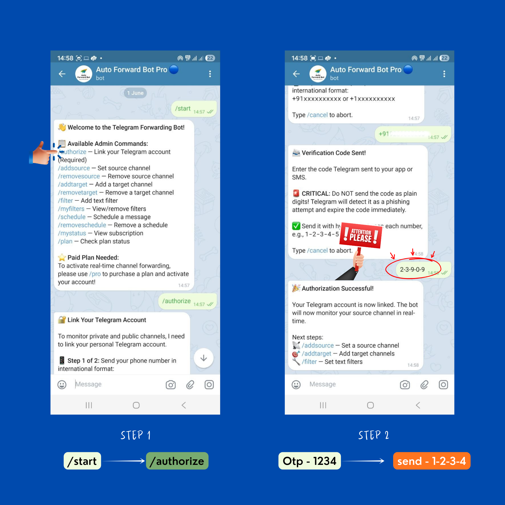
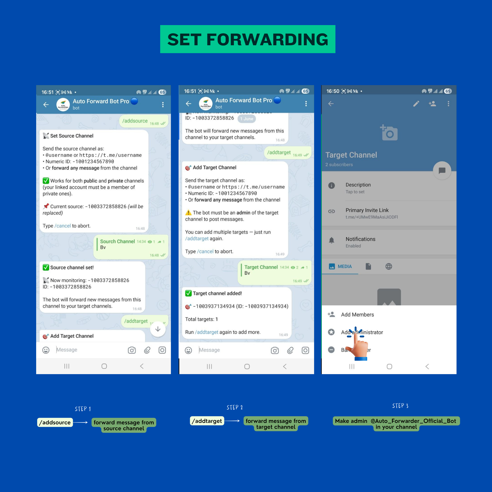
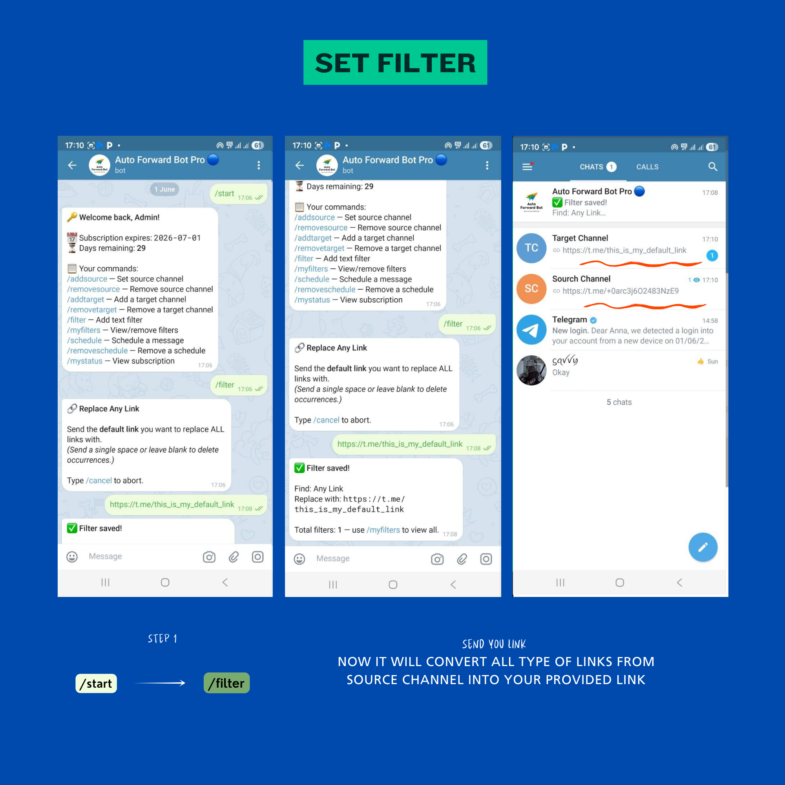
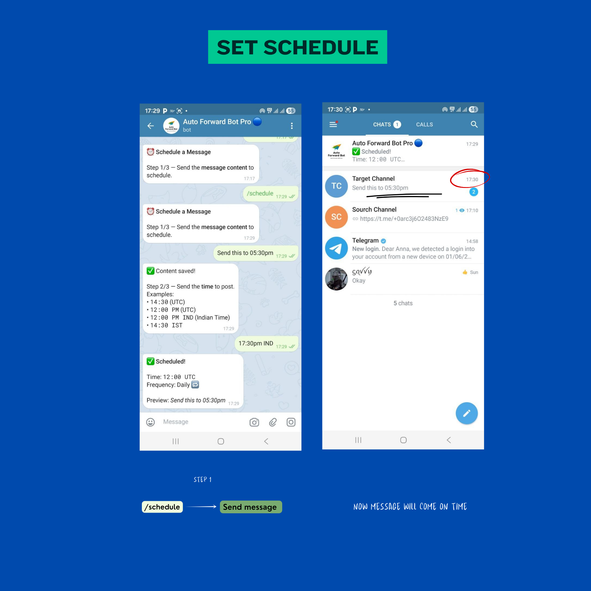

# Auto Forward Bot Pro


A production-ready Telegram bot that acts as your personal automated forwarding assistant. Built with **python-telegram-bot v20+**, **Telethon** (Userbot), and **Supabase**, this bot offers role-based access control, real-time message forwarding from both public and private channels, advanced dynamic text filters, message scheduling, and an integrated premium subscription system.

---

## 🌟 Key Features

| Feature | Details |
|---|---|
| 🔁 **Real-time Forwarding** | Forward all message types instantly. Supports both **Public** and **Private** source channels using an integrated Userbot system! |
| 🔍 **Dynamic Text Filters** | Automatically replace *any* link or *any* username in a message with your own, or define specific find/replace text rules and blocked words. |
| ⏰ **Scheduling** | Schedule messages to be sent one-time or daily. Supports IST (Indian Standard Time) and UTC formats natively. |
| 💳 **Integrated Payments** | Automated Razorpay integration and Crypto (USDT) support. Users can upgrade to Premium seamlessly inside the bot via `/pro`. |
| 👥 **Role & Trial System** | Trial users are prompted to upgrade. Admins gain access to forwarding capabilities. Super Admin can manage all users. |
| ⚡ **Auto-Demotion** | The bot checks for expired subscriptions continuously and demotes admins automatically. |

---

## 📖 How to Use (Step-by-Step)

The bot comes with a built-in interactive `/help` menu to guide users. Here is how the core features work:

### 1. Link Your Account (`/howtoauth`)
To forward messages from private channels, the bot securely links to your Telegram account.

- Run `/authorize` and provide your phone number (e.g., `+91...`).
- Submit the 5-digit OTP sent by Telegram (use a hyphen like `12-345` for security).

### 2. Set Up Forwarding (`/howtoaddforwarding`)

- Run `/addsource` and provide the channel username or ID to copy *from*.
- Run `/addtarget` to specify where messages should be forwarded *to*. You can add multiple targets!

### 3. Set Up Dynamic Filters (`/howtosetfilter`)

- Run `/filter` to open the interactive menu.
- Choose to instantly replace **Any Link**, **Any Username**, or set up custom word replacements and blocks. 

### 4. Schedule Messages (`/howtoschedule`)

- Run `/schedule`, provide your content, and set a time (e.g., `14:30`, `12:00 PM`, `05:30 PM IND`).
- Choose whether it should repeat daily or run just once.

### 5. Upgrade to Premium (`/howtopro`)

- Run `/pro` to view subscription plans.
- Pay via INR (UPI/Razorpay) or Crypto (USDT) and confirm payment directly inside the bot.

---

## ⚙️ Setup & Installation

### 1. Clone and install dependencies
```bash
git clone https://github.com/yourusername/auto-forword-bot.git
cd auto-forword-bot
python -m venv venv
source venv/bin/activate    # Windows: venv\Scripts\activate
pip install -r requirements.txt
```

### 2. Configure environment variables
```bash
cp .env.example .env
```
Edit `.env` with your values:
```env
BOT_TOKEN=your_bot_token_here         # From @BotFather
TELEGRAM_API_ID=1234567               # From my.telegram.org
TELEGRAM_API_HASH=your_api_hash       # From my.telegram.org
SUPABASE_URL=https://xxx.supabase.co  # Your Supabase project URL
SUPABASE_KEY=your_supabase_key_here   # anon or service_role key
SUPER_ADMIN_ID=123456789              # Your Telegram user ID
RAZORPAY_KEY_ID=optional_key          # For automated INR payments
RAZORPAY_KEY_SECRET=optional_secret
```

### 3. Set up Supabase Database
1. Open your [Supabase project](https://supabase.com) → SQL Editor
2. Run the provided `supabase_schema.sql` script to create the tables.

### 4. Run the Bot
```bash
python3 -m bot.main
```

---

## 🛠 Commands Reference

### Super Admin (`SUPER_ADMIN_ID`)
| Command | Description |
|---|---|
| `/stats` | View total admins, channels, and income statistics |
| `/alladmins` | List all premium admins and their expiration dates |
| `/allchannels` | List all active source and target channels |
| `/addadmin` | Manually promote a user to Admin status |
| `/removeadmin` | Demote an admin immediately |
| `/grant_premium` | Quick command to grant premium to a specific user ID |

### Admin (Premium Features)
| Command | Description |
|---|---|
| `/authorize` | Link Telegram account (Required for Userbot) |
| `/addsource` | Set the channel to monitor and forward messages from |
| `/addtarget` | Add a destination channel to forward messages to |
| `/filter` | Add text filters, link replacers, or block words |
| `/myfilters` | View and remove active filters |
| `/schedule` | Schedule a message to be sent to targets |
| `/removeschedule`| View and cancel scheduled messages |
| `/mystatus` | Check account authorization and subscription expiry |

### General Users
| Command | Description |
|---|---|
| `/start` | Welcome message and initial registration |
| `/help` | Interactive step-by-step image tutorials |
| `/pro` | View premium subscription plans and purchase |
| `/plan` | View current trial or subscription status |
